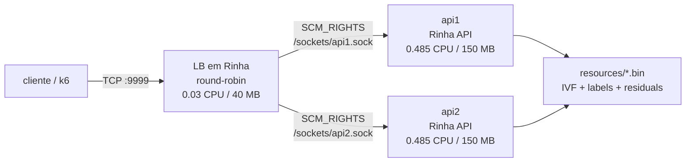
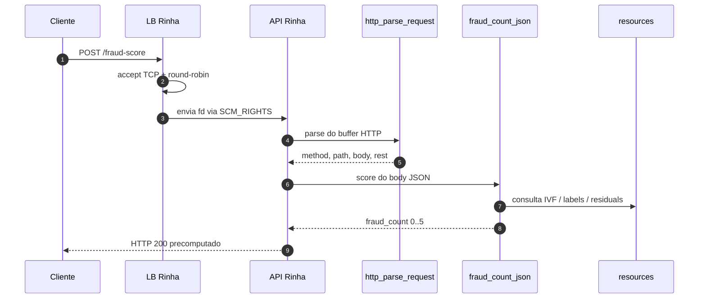

# Documentação técnica

Este documento descreve a arquitetura da solução em [Rinha](https://github.com/cleissonbarbosa/rinha-de-compiler/blob/main/SPECS.md), o hot path de uma requisição e os pontos que dependem do meu [interpretador Haskell](https://github.com/cleissonbarbosa/rinha-compiladores-haskell). O objetivo do projeto é manter a aplicação e o load balancer em Rinha, usando builtins nativos apenas para operações que a linguagem original não oferece.

## Topologia

O `docker-compose.yml` sobe duas APIs e um load balancer dentro do limite de 1 CPU. O volume `sockets` é um `tmpfs` compartilhado; nele as APIs expõem sockets Unix para receber descritores via SCM_RIGHTS.

## Fluxo da requisição

Fluxo resumido: o LB aceita a conexão, encaminha o descritor de arquivo (fd) para uma API e fecha sua cópia local — sem relayer de bytes. A API passa a ler/escrever diretamente no socket do cliente.

Observação prática: o LB também tem fallback por proxy TCP (`net_connect_addr` + `net_proxy`) — útil ao executar as APIs sem `API_FD_SOCKET`. No compose padrão, o handoff por fd é o caminho preferencial.

## Endpoints

| Método | Rota | Resposta |
| --- | --- | --- |
| `GET` | `/ready` | `{"ready":true}` depois do warmup do índice |
| `POST` | `/fraud-score` | `{"approved":bool,"fraud_score":float}` |

A aprovação vem da contagem de fraudes entre os 5 vizinhos: `0..2` → aprovado; `3..5` → reprovado.

## Hot path da API

1. `ivf_warmup()` roda na inicialização para preparar os arquivos do índice.
2. `net_fd_serve` entrega a `serveConn` cada descritor (fd) recebido do LB.
3. `readReq` acumula bytes até que `http_parse_request` retorne uma requisição completa.
4. `route` valida método/rota e invoca `classify` para `/fraud-score`.
5. `classify` repassa o corpo bruto para `fraud_count_json`.
6. `respScore` escolhe uma das seis respostas HTTP pré-geradas.
7. `serveConn` reaproveita `p.rest` para keep-alive e pipelining.

Técnica: o parser HTTP é nativo (builtin) para evitar reanalisar buffers grandes no interpretador. O score também é nativo: analisa o JSON, normaliza a transação, consulta o IVF e retorna apenas `fraud_count` (0..5) para o programa Rinha.

## Builtins do runtime

A linguagem Rinha original expõe apenas `Print`. Aqui usamos uma branch estendida do interpretador Haskell com primitivos de baixo nível:

| Builtin | Papel |
| --- | --- |
| `env`, `env_int` | leitura de variáveis de ambiente |
| `str_*` | operações byte-oriented em strings do código Rinha |
| `net_listen_addr`, `net_serve` | listener TCP e loop de accept |
| `net_fd_listen`, `net_fd_serve` | listener Unix para receber fds via `SCM_RIGHTS` |
| `net_fd_send_addr` | envio de fd aceito para uma API |
| `net_connect_addr`, `net_recv`, `net_send`, `net_close` | I/O de socket cru |
| `net_proxy` | relay bidirecional nativo para fallback TCP |
| `counter_new`, `counter_next` | contador atômico para round-robin |
| `ivf_warmup`, `ivf_query` | inicialização e consulta do índice vetorial |
| `http_parse_request` | request line, headers, `Content-Length`, body e bytes restantes |
| `fraud_count_json` | análise JSON, vetorização, consulta kNN e decisão por voto |

Nao ha framework HTTP dentro do runtime. O programa Rinha ainda decide rota, status, corpo e politica de keep-alive.

## Recursos binários

O container copia `resources/` para `/app/resources` e usa `RESOURCES_DIR`:

| Arquivo | Conteúdo |
| --- | --- |
| `vectors.bin` | matriz quantizada de vetores de referência (~84 MB) |
| `labels.bin` | label fraude/legítimo (1 byte por vetor) |
| `residuals.bin` | ajuste para refinamento do score (~42 MB) |
| `ivf.bin` | metadados, centroides e limites dos clusters |
| `normalization.json` | limites e escalas das features |
| `mcc_risk.json` | risco base por MCC |

Cada API carrega e aquece o índice na inicialização; durante o atendimento não se releem nem reanalisam esses arquivos.

## Vetorização e score

`fraud_count_json` transforma a transação em um vetor de 14 dimensões:

1. valor da transação;
2. número de parcelas;
3. relação entre `amount` e média histórica do cliente;
4. hora do dia;
5. dia da semana;
6. minutos desde a última transação;
7. distância da última transação;
8. distância da casa;
9. transações nas últimas 24h;
10. flag `is_online`;
11. flag `card_present`;
12. merchant desconhecido para o cliente;
13. risco do MCC;
14. média histórica do merchant.

O resultado final e `fraud_count`, isto e, quantos dos 5 vizinhos mais proximos sao fraude. A API mapeia essa contagem diretamente para uma resposta estatica:

| `fraud_count` | `approved` | `fraud_score` |
| --- | --- | --- |
| `0` | `true` | `0.0` |
| `1` | `true` | `0.2` |
| `2` | `true` | `0.4` |
| `3` | `false` | `0.6` |
| `4` | `false` | `0.8` |
| `5` | `false` | `1.0` |

## Build e imagens

`make rinha-check`:

1. gera `build/server.json` a partir de `rinha/server.rinha`;
2. gera `build/lb.json` a partir de `rinha/lb.rinha`;
3. compila o interpretador Haskell local e copia o binário para `build/rinha-interp`.

As imagens Docker finalizadas simplesmente copiam o runtime, o AST JSON pré-compilado e os recursos; não há compilação de Rinha dentro do container.

## Variáveis da API

| Variável | Padrão | Descrição |
| --- | --- | --- |
| `API_ADDR` | `0.0.0.0:8080` | endereço TCP se `API_FD_SOCKET` estiver vazio |
| `API_FD_SOCKET` | vazio | socket Unix para receber conexões via handoff |
| `RESOURCES_DIR` | `/app/resources` | diretório dos recursos |
| `KNN_CANDIDATES` | `128` | candidatos considerados pelo KNN nativo |
| `RINHA_PROBE` | `3` no compose | número de clusters IVF sondados |
| `RINHA_RESIDUAL_REFINE` | `1` | habilita refinamento com `residuals.bin` |
| `RINHA_NET_MAX_THREADS` | `512` | limite de threads/conexões no runtime nativo |

## Variáveis do LB

| Variável | Padrão | Descrição |
| --- | --- | --- |
| `LB_ADDR` | `0.0.0.0:9999` | endereço público do LB |
| `BACKEND1` | `api1:8080` | backend TCP da API 1 (fallback) |
| `BACKEND2` | `api2:8080` | backend TCP da API 2 (fallback) |
| `FD_BACKEND1` | vazio | socket Unix da API 1 para handoff |
| `FD_BACKEND2` | vazio | socket Unix da API 2 para handoff |
| `LB_CHUNK_SIZE` | `65536` | buffer do fallback `net_proxy` |
| `RINHA_NET_MAX_THREADS` | `512` | limite de threads/conexões |

## Limites e observações

- Depende do meu [interpretador Haskell](https://github.com/cleissonbarbosa/rinha-compiladores-haskell) da [Rinha de Compiladores](https://github.com/aripiprazole/rinha-de-compiler); a linguagem original não tem sockets, `env`, bytes de string nem acesso a arquivos de índice.
- Usei builtins nativos para parse HTTP e score; a casca HTTP, roteamento e resposta ficam em Rinha.
- O score nativo reexecuta parse, normalização e consulta por requisição; não há cache por transação.
- Com `API_FD_SOCKET` definido, a API recebe fds via Unix socket. Para testar fallback TCP, rode a API sem essa variável.

