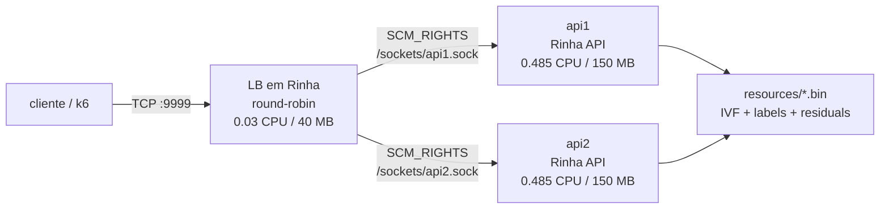
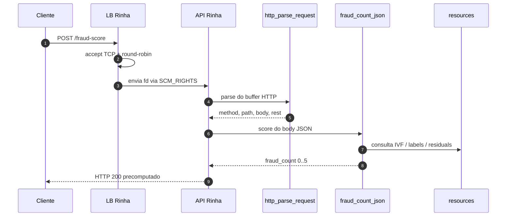

# Documentacao tecnica

Este documento descreve a arquitetura da solucao em Rinha, o caminho quente de uma requisicao e os pontos que dependem do interpretador estendido. O objetivo do projeto e manter a aplicacao e o load balancer em Rinha, usando builtins nativos somente para operacoes que a linguagem original nao oferece.

## Topologia



O `docker-compose.yml` usa duas APIs e um load balancer dentro do limite de 1 CPU. O volume nomeado `sockets` e um `tmpfs` compartilhado entre os containers; nele as APIs publicam os sockets Unix usados para receber descritores de arquivo.

## Fluxo da requisicao



No caminho principal o LB nao faz relay de bytes depois do handoff: ele aceita a conexao, envia o fd aceito para uma API e fecha a sua copia local. A API passa a ler e escrever diretamente no socket do cliente.

O codigo do LB tambem tem fallback por proxy TCP usando `net_connect_addr` e `net_proxy`. Esse modo e util quando as APIs rodam sem `API_FD_SOCKET`; no compose atual, o caminho esperado e o handoff por fd.

## Endpoints

| Metodo | Rota | Resposta |
| --- | --- | --- |
| `GET` | `/ready` | `{"ready":true}` depois do warmup do indice |
| `POST` | `/fraud-score` | `{"approved":bool,"fraud_score":float}` |

A aprovacao e derivada do numero de fraudes nos 5 vizinhos: scores `0`, `1` e `2` aprovam; `3`, `4` e `5` reprovam.

## Hot path da API

1. `ivf_warmup()` e chamado no boot para preparar os arquivos do indice.
2. `net_fd_serve` entrega para `serveConn` cada fd recebido do LB.
3. `readReq` acumula bytes ate `http_parse_request` devolver uma requisicao completa.
4. `route` valida metodo e rota e chama `classify` para `/fraud-score`.
5. `classify` delega o corpo bruto para `fraud_count_json`.
6. `respScore` seleciona uma das seis respostas HTTP precomputadas.
7. `serveConn` reaproveita `p.rest` para keep-alive e pipelining.

O parse HTTP fica em builtin para evitar reescanear strings grandes no interpretador. O score tambem esta em builtin: ele parseia o JSON, normaliza a transacao, consulta o IVF e devolve apenas a contagem de fraudes `0..5` para o programa Rinha.

## Builtins do runtime

A linguagem Rinha original expoe basicamente `Print`. Este projeto depende de uma branch estendida do interpretador Haskell com primitivos de baixo nivel:

| Builtin | Papel |
| --- | --- |
| `env`, `env_int` | leitura de variaveis de ambiente |
| `str_*` | operacoes byte-oriented em strings usadas pelo codigo Rinha |
| `net_listen_addr`, `net_serve` | listener TCP e accept loop |
| `net_fd_listen`, `net_fd_serve` | listener Unix para receber fds via `SCM_RIGHTS` |
| `net_fd_send_addr` | envio de fd aceito para uma API |
| `net_connect_addr`, `net_recv`, `net_send`, `net_close` | I/O de socket cru |
| `net_proxy` | relay bidirecional nativo para fallback TCP |
| `counter_new`, `counter_next` | contador atomico usado no round-robin |
| `ivf_warmup`, `ivf_query` | inicializacao e consulta do indice vetorial |
| `http_parse_request` | request line, headers, `Content-Length`, body e bytes restantes |
| `fraud_count_json` | parse JSON, vetorizacao, consulta kNN e voto final |

Nao ha framework HTTP dentro do runtime. O programa Rinha ainda decide rota, status, corpo e politica de keep-alive.

## Recursos binarios

O container da API copia `resources/` para `/app/resources` e usa `RESOURCES_DIR` para localizar os arquivos:

| Arquivo | Conteudo |
| --- | --- |
| `vectors.bin` | matriz quantizada de vetores de referencia, aproximadamente 84 MB |
| `labels.bin` | label fraude/legitimo, 1 byte por vetor |
| `residuals.bin` | ajuste usado no refinamento do score, aproximadamente 42 MB |
| `ivf.bin` | metadados, centroides e boundaries dos clusters IVF |
| `normalization.json` | limites e escalas das features |
| `mcc_risk.json` | risco base por MCC |

Cada API carrega e aquece o indice no startup. Depois disso, o request path nao deve reler nem parsear esses arquivos.

## Vetorizacao e score

O builtin `fraud_count_json` transforma a transacao em um vetor de 14 dimensoes compativel com o indice:

1. valor da transacao;
2. numero de parcelas;
3. relacao entre `amount` e media historica do cliente;
4. hora do dia;
5. dia da semana;
6. minutos desde a ultima transacao;
7. distancia da ultima transacao;
8. distancia da casa;
9. transacoes nas ultimas 24h;
10. flag `is_online`;
11. flag `card_present`;
12. merchant desconhecido para o cliente;
13. risco do MCC;
14. media historica do merchant.

O resultado final e `fraud_count`, isto e, quantos dos 5 vizinhos mais proximos sao fraude. A API mapeia essa contagem diretamente para uma resposta estatica:

| `fraud_count` | `approved` | `fraud_score` |
| --- | --- | --- |
| `0` | `true` | `0.0` |
| `1` | `true` | `0.2` |
| `2` | `true` | `0.4` |
| `3` | `false` | `0.6` |
| `4` | `false` | `0.8` |
| `5` | `false` | `1.0` |

## Build e imagens

`make rinha-check` faz tres coisas:

1. gera `build/server.json` a partir de `rinha/server.rinha`;
2. gera `build/lb.json` a partir de `rinha/lb.rinha`;
3. compila o interpretador Haskell local e copia o binario para `build/rinha-interp`.

As imagens Docker sao finais e simples: copiam o runtime, o AST JSON ja precompilado e os arquivos de recursos. Nao ha compilacao de Rinha dentro do container de runtime.

## Variaveis da API

| Variavel | Padrao | Descricao |
| --- | --- | --- |
| `API_ADDR` | `0.0.0.0:8080` | endereco TCP usado quando `API_FD_SOCKET` esta vazio |
| `API_FD_SOCKET` | vazio | socket Unix usado para receber conexoes aceitas pelo LB |
| `RESOURCES_DIR` | `/app/resources` | diretorio dos arquivos `resources/*` |
| `KNN_CANDIDATES` | `128` | candidatos considerados pelo score nativo |
| `RINHA_PROBE` | `3` no compose | clusters IVF sondados por consulta |
| `RINHA_RESIDUAL_REFINE` | `1` | habilita refinamento com `residuals.bin` |
| `RINHA_NET_MAX_THREADS` | `512` | limite de threads/conexoes do runtime nativo |

## Variaveis do LB

| Variavel | Padrao | Descricao |
| --- | --- | --- |
| `LB_ADDR` | `0.0.0.0:9999` | endereco publico do load balancer |
| `BACKEND1` | `api1:8080` | backend TCP primario da API 1 para fallback |
| `BACKEND2` | `api2:8080` | backend TCP primario da API 2 para fallback |
| `FD_BACKEND1` | vazio | socket Unix da API 1 para handoff por fd |
| `FD_BACKEND2` | vazio | socket Unix da API 2 para handoff por fd |
| `LB_CHUNK_SIZE` | `65536` | tamanho do buffer do fallback `net_proxy` |
| `RINHA_NET_MAX_THREADS` | `512` | limite de threads/conexoes do runtime nativo |

## Testes

```sh
make smoke           # sobe compose e valida /ready + /fraud-score
make official-smoke  # executa test/smoke.js do repositorio oficial
make official-test   # executa test/test.js do repositorio oficial e imprime results.json
```

`scripts/official-test.sh` clona `zanfranceschi/rinha-de-backend-2026` em `../rinha-de-backend-2026` caso o repositorio oficial ainda nao exista.

## Limites honestos do port

- O projeto depende de um interpretador Rinha estendido; a linguagem original nao tem sockets, env, bytes de string nem acesso a arquivos de indice.
- O caminho atual usa builtins nativos para parse HTTP e score. A casca HTTP, o roteamento, o balanceamento e a resposta continuam em Rinha.
- O score nativo recalcula parse, normalizacao e consulta para cada request; nao ha cache de resultado por transacao.
- Com `API_FD_SOCKET` definido, a API serve fds recebidos via Unix socket. Para testar o fallback TCP puro, rode a API sem essa variavel.
- O runtime continua sendo um interpretador tree-walking em Haskell. O objetivo aqui e o port para Rinha, nao competir com uma implementacao nativa em Rust/C no mesmo custo de CPU.
